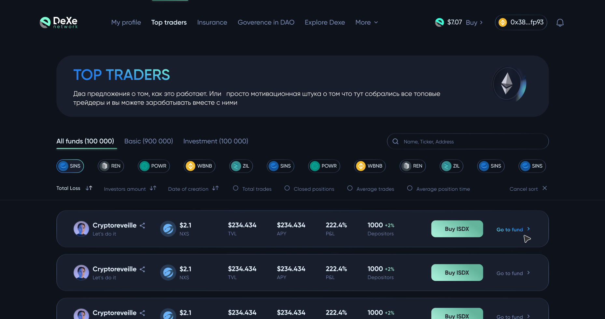

# Dexe investments interface


## Development
---
### Configuration
check `.env.local.example` and provide those values to your `.env.local` file:
1. Infura id
2. Etherscan api key
3. Infura ipfs id
3. Infura ipfs secret

### Install Dependencies
install node_modules
```bash
yarn
```

### Run

will create local https connection on port: 3000

```bash
yarn start
```

### build prod

will create `/build` folder in root directory

```bash
    yarn build
```

### create component / redux state
generate components with one command
```bash
    yarn run c Button
    yarn run r users
```

### update ABI files
checks local abi folder and updates with new one
```bash
    node updateABI.js /your_abi_folder_path && yarn run lint-abi
```

example:

```bash
node updateABI.js "/Users/ih8apple//Downloads/Telegram Desktop/contracts 7" && yarn run lint-abi
```